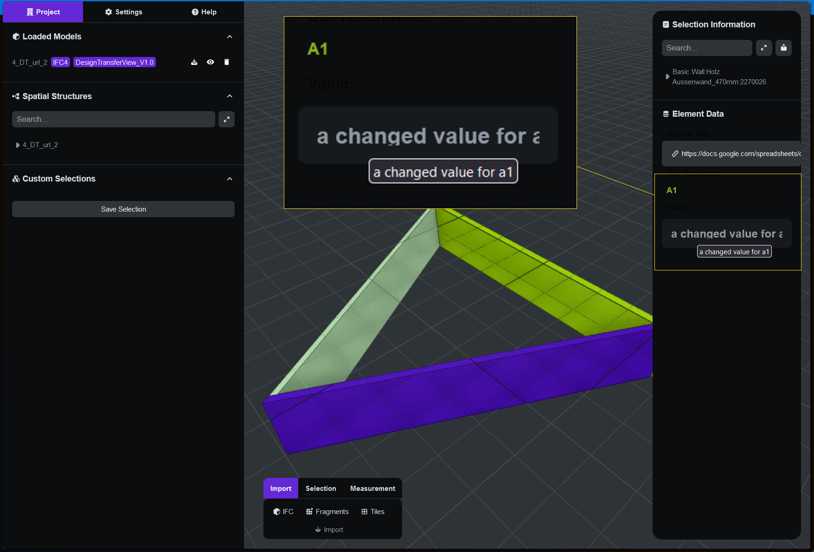

# BIM Viewer with Google Sheets Integration 🏗️

<p align="center">
  <a href="https://www.typescriptlang.org/">
    
  </a>
  <a href="https://www.npmjs.com/package/@thatopen/components">
    
  </a>
  <a href="https://threejs.org/">
    
  </a>
  <a href="https://vitejs.dev/">
    
  </a>
  <a href="https://github.com/IFCjs/web-ifc">
    
  </a>
  <a href="LICENSE">
    
  </a>
</p>

> A BIM viewer that integrates with Google Sheets to display and manage building element data in real-time.

<div align="center">
  
</div>

## ✨ Features

- 🏢 **Advanced BIM Viewing**

  - Load and render IFC models with high performance
  - Support for large-scale building models
  - Real-time model navigation and interaction

- 📊 **Google Sheets Integration**

  - Live data fetching from Google Sheets
  - Automatic cell value display
  - Direct spreadsheet linking
  - Smart cell reference parsing

- 🔍 **Element Information**
  - Detailed property inspection
  - Real-time property updates
  - Custom data visualization
  - Export capabilities

## 🚀 Quick Start

1. **Installation**

```bash
npm install
```

2. **Development**

```bash
npm run dev
```

3. **Production Build**

```bash
npm run build
```

## 📖 Usage

### Loading Models

```typescript
// Import your IFC model
const ifcLoader = components.get(OBC.IfcLoader);
await ifcLoader.setup();
```

### Google Sheets Integration

The viewer expects Google Sheets URLs in the following format:

```
https://docs.google.com/spreadsheets/d/{sheet-id}/edit?gid=0&range=A1
```

## 🛠️ Tech Stack

- **Frontend Framework**: That Open Components
- **3D Engine**: Three.js
- **Build Tool**: Vite
- **Language**: TypeScript
- **Data Parsing**: Papa Parse

## 📦 Dependencies

This project stands on the shoulders of giants:

- [**That Open Components**](https://thatopen.com/) - The open ecosystem for the AECO industry, providing cutting-edge BIM technology and fostering a vibrant community
- [**Three.js**](https://threejs.org/) - A powerful 3D graphics library that makes WebGL simple
- [**Web IFC**](https://github.com/ThatOpen/engine_web-ifc) - Reading and writing IFC files with Javascript at native speeds (646+ stars)
- [**Papa Parse**](https://www.papaparse.com/) - The powerful, in-browser CSV parser for big data

```json
{
  "@thatopen/components": "~2.4.2",
  "@thatopen/components-front": "~2.4.2",
  "@thatopen/fragments": "~2.4.0",
  "@thatopen/ui": "~2.4.0",
  "@thatopen/ui-obc": "~2.4.0",
  "papaparse": "^5.4.1",
  "three": "0.160.1",
  "web-ifc": "~0.0.66"
}
```

## 🤝 Contributing

Contributions are welcome! Please feel free to submit a Pull Request.

## 📄 License

This project is licensed under the MIT License - see the [LICENSE](LICENSE) file for details.

---

<div align="center">
  Made with ❤️ by the BIM community
</div>
